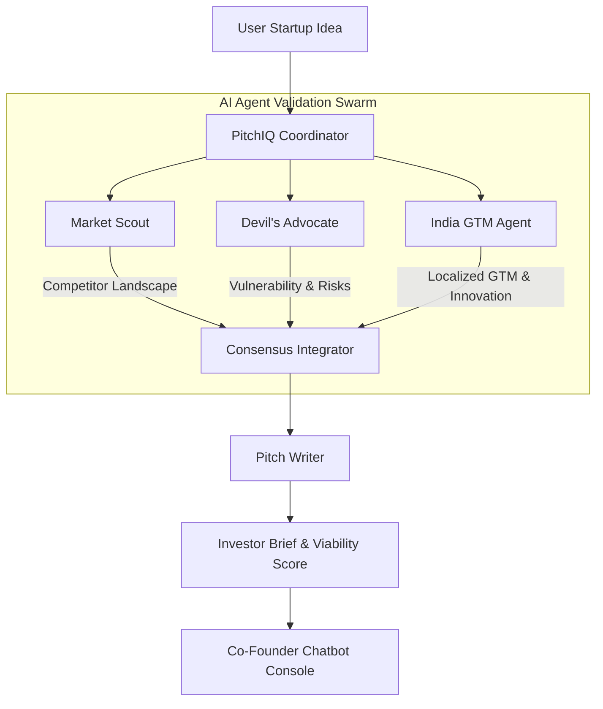
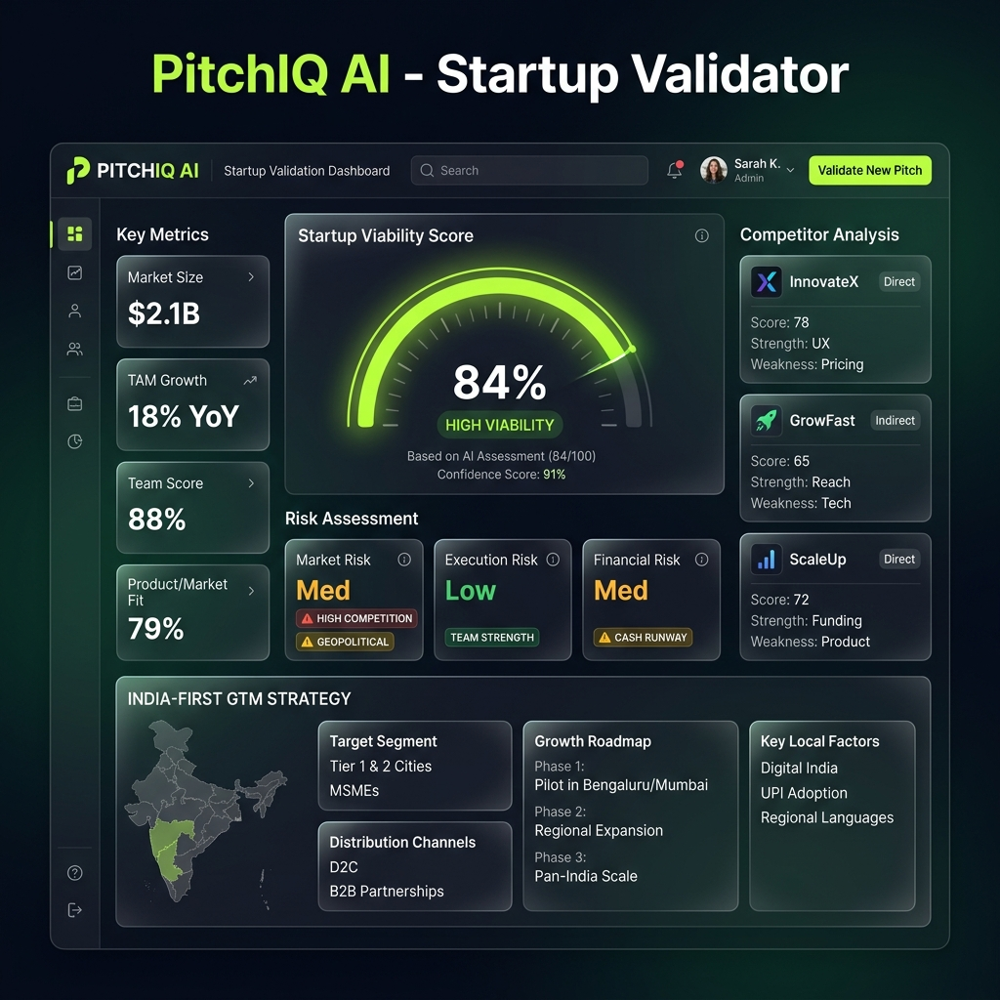

# PitchIQ AI - Your AI Co-Founder Swarm 🚀

A synchronized AI validation swarm running real-time competitive analysis, risk testing, and localized India-first GTM playbooks.

---

## Problem

First-time founders and builders face massive uncertainty when validating startup ideas. Traditional market research is slow, expensive, and fails to identify hyper-local execution risks, leaving teams with generic strategies and unstructured pitch outlines.

---

## Solution

PitchIQ solves this by providing an autonomous swarm of AI agents that instantly research competitors, pressure-test business assumptions, map out localization roadmaps (e.g. UPI/WhatsApp hooks), and output a structured, downloadable investor brief.

---

## How PitchIQ Works (Multi-Agent Swarm)

When a startup idea is input, PitchIQ coordinates specialized agents:



- **Market Scout**: Evaluates competitor landscapes, pricing models, and SWOT points.
- **Devil's Advocate**: Pressure-tests assumptions to find potential failures and bottlenecks.
- **India GTM Agent**: Outlines regional rollouts, vernacular interfaces, and UPI/ONDC integrations.
- **Pitch Writer**: Consolidates swarm intelligence into the final viability index and downloadable investor memorandum.

---

## Features

- **Viability Assessment Index**: 0-100 rating scale across parameters like Market Potential, India Fit, and Competition.
- **Competitor Mapping**: Detailed SWOT analysis of primary incumbents with their pricing models.
- **Vulnerability Analysis**: Anticipates risk vectors (e.g. CAC inflation, compliance) with impact ratings.
- **India-First Playbook**: Actionable roadmap emphasizing UPI settlement, WhatsApp bots, and ONDC catalogs.
- **Core Innovation Callout**: Visualizes your startup's core differentiators and technical moats.
- **One-Page Investor Brief**: Interactive summaries available for instant `.txt` file download.
- **Interactive Co-Founder Chat**: Brainstorm strategy with the co-founder agents in real-time.

---

## Tech Stack

- **Frontend**: React 19, TypeScript, Vite, Tailwind CSS, Framer Motion, Spline 3D (with 2D Canvas fallback).
- **Backend**: Node.js, Express, Cors, Dotenv.
- **AI Core**: Google GenAI SDK (Gemini 2.5 Flash / Gemini 2.5 Pro).

---

## Setup

### 1. Prerequisites
Ensure you have [Node.js](https://nodejs.org/) installed (version 18+).

### 2. Installation
Install project dependencies in the root directory:
```bash
npm install
```

### 3. Environment Variable
Create a `.env` file in the root directory:
```env
GEMINI_API_KEY="your-google-gemini-api-key"
```
*Note: If no API key is specified, the application will automatically fall back to the dynamic rules-based mock engine.*

### 4. Start Development Servers
Start both the backend and frontend concurrently:
```bash
npm run dev
```

---

## Usage

1. **Input Startup Concept**: Enter your startup description in the main textarea.
2. **Launch AI Swarm**: Click **Analyze Startup** to trigger the analysis engine.
3. **Inspect Live Reasoning**: Scroll to check the **Agent Activity Console** as log inputs stream.
4. **Read Report Sections**: Review the Viability Score, Competitor Landscape, GTM Roadmap, and Innovation panel.
5. **Download Memorandum Brief**: Click **Download PDF Brief** to save your investor brief.
6. **Consult AI Swarm**: Use the bottom interactive chat to ask follow-up questions.

---

## Screenshots

Below is a flat UI dashboard preview of PitchIQ AI:



---

## Demo

- **Frontend App Url (Local)**: `http://localhost:5173`
- **Backend API Url (Local)**: `http://localhost:5001`
- **Render Production Url**: Connected for auto-deployment via Github integration.

---

## Team / License

- **License**: MIT License - feel free to use and adapt this system for your own startup builds.
- **Creator**: Developed as a modern validation tool for founders.
