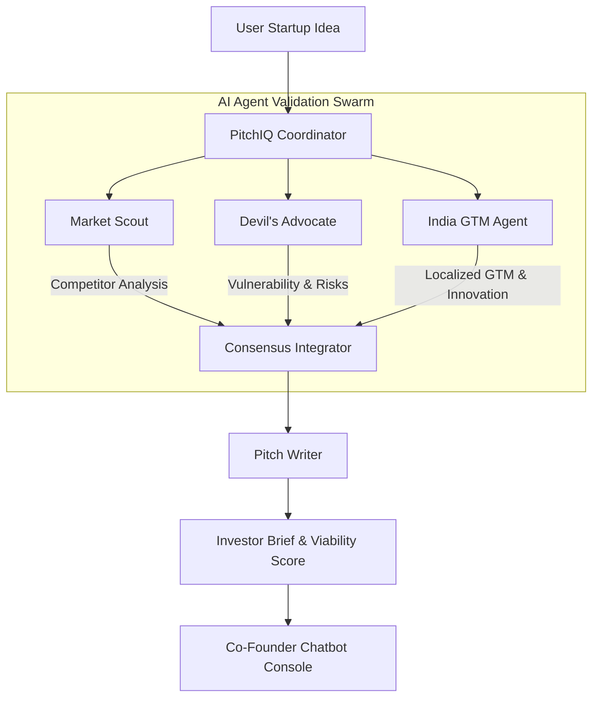

# PitchIQ AI - Your AI Co-Founder Swarm 🚀

PitchIQ is an AI-powered startup validation engine and co-founder swarm that analyzes your startup idea in real-time, compiles competitor intelligence, identifies key business risks, creates an India-first GTM strategy, and drafts an investor-ready pitch.


---

## How PitchIQ Works (Multi-Agent Swarm)

When you input a startup idea, PitchIQ spawns a synchronized swarm of specialized AI validation agents running consensus checks:



- **Market Scout**: Conducts competitor research to identify direct and indirect alternatives.
- **Devil's Advocate**: Challenges assumptions and identifies critical vulnerability vectors.
- **India GTM Agent**: Formulates a go-to-market playbook tailored to the local Indian landscape, highlighting UPI/ONDC integrations, vernacular strategies, and core differentiation.
- **Pitch Writer**: Consolidates all agent consensus data into a structured investor memorandum and scores startup viability.

---

## Key Features

- **Viability Assessment Index**: 0-100 rating scale across five parameters: Market Potential, India Fit, Investor Appeal, Competition, and Execution Difficulty.
- **Competitor Mapping**: Detailed SWOT analysis of primary market incumbents, detailing their pricing models, strengths, and weaknesses.
- **Vulnerability Analysis**: Anticipates risk vectors (e.g. CAC inflation, regulatory barriers, supply churn) along with their business impact level.
- **India-First Playbook**: Actionable roadmap phases emphasizing localization, voice-ledgers, WhatsApp onboarding, and ONDC Commission bypasses.
- **Core Innovation Callout**: Visualizes how your startup stands out and details unique operational/technical advantages.
- **One-Page Investor Brief**: Summarizes the Problem, Solution, Market Opportunity, Revenue Model, and Moat, available for instant text download.
- **Interactive Co-Founder Chat**: Continue brainstorming your strategy, querying risks, or refining your product value proposition with the AI swarm in real-time.

---

## Tech Stack

- **Frontend**: React 19, TypeScript, Vite, Tailwind CSS, Framer Motion, Spline 3D (with 2D Canvas fallback).
- **Backend**: Node.js, Express, Cors, Dotenv.
- **AI Core**: Google GenAI SDK (Gemini 2.5 Flash / Gemini 2.5 Pro).

---

## Local Development Setup

### 1. Prerequisites
Ensure you have [Node.js](https://nodejs.org/) installed (version 18+ recommended).

### 2. Install Dependencies
Clone the repository and install packages in the root:
```bash
npm install
```

### 3. Add API Credentials
Create a `.env` file in the root directory and add your Google Gemini API Key:
```env
GEMINI_API_KEY="your-gemini-api-key"
```
*Note: If no API key is found, the server automatically falls back to the dynamic, rule-based mock engine.*

### 4. Start Development Servers
Run the backend and frontend concurrently:
```bash
npm run dev
```
- **Frontend App**: `http://localhost:5173`
- **Backend Server**: `http://localhost:5001`
